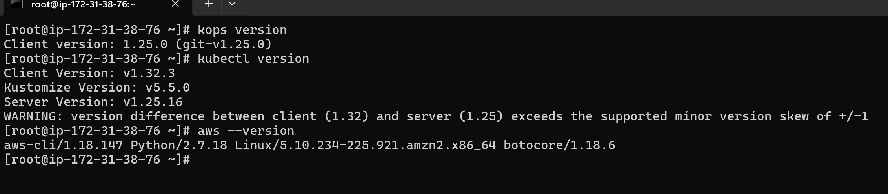
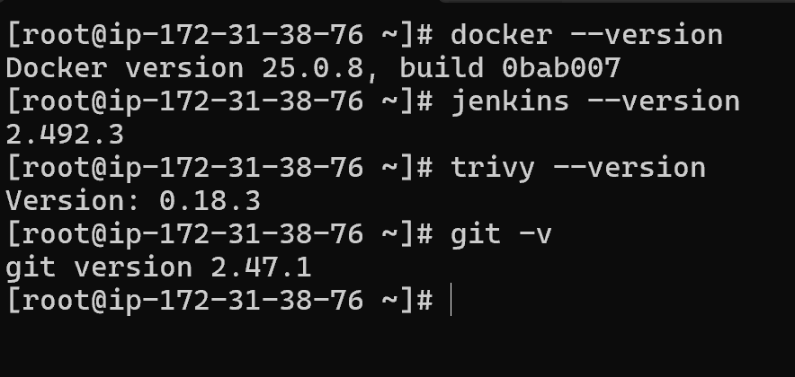
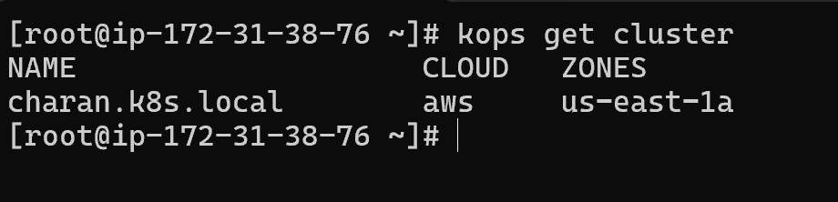
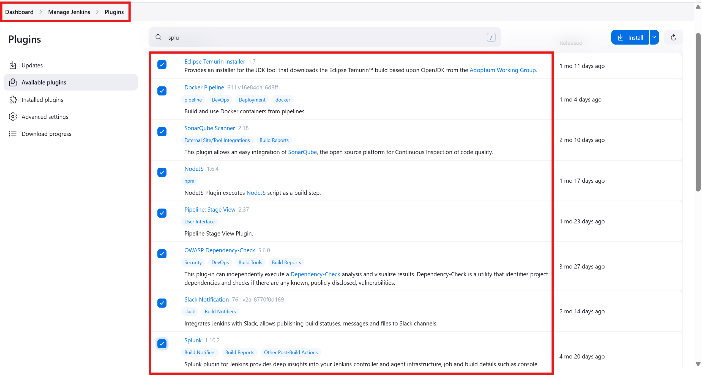

# Node.js CI/CD Pipeline with Kubernetes on AWS

This project explains how to deploy an end-to-end **Node.js application** using a complete CI/CD pipeline on AWS.

---

## 🚀 Project Flow

The deployment pipeline includes the following stages:

1. **Build a CI/CD Pipeline**  
2. **Fetch Code from GitHub**
3. **Perform SonarQube Code Analysis**
4. **Run OWASP Dependency Check**
5. **Build Docker Image and Run Trivy Image Scan**
6. **Push Docker Image to Docker Hub**

---

## 🛠️ Kubernetes Deployment

- Write Kubernetes **manifest files**
- Install **Helm** for managing deployments
- Set up **ArgoCD** for GitOps-based deployment
- Implement **monitoring** using Prometheus and Grafana

---

> All steps are automated to ensure smooth, secure, and continuous delivery of the application to a Kubernetes cluster managed with KOPS on AWS.

## 🔧 Setup Instructions

Below are the key steps involved in the complete setup of the Node.js CI/CD pipeline on AWS with Kubernetes, Jenkins, ArgoCD, and monitoring.

---

### ✅ Install Dependencies and Plugins for Jenkins
Install all dependencies plugins (e.g., **Git, Docker, Jenkins, Trivy, Kubectl, kops,** etc.).
Install all plugins required for Jenkins pipeline. (e.g., **docker-pipeline, Eclipse Temurin Installer, SonarQube Scanner, NodeJs, docker pipeline, owasp dependency check Plugin, slack notification and splunk**) 

# Step-1 Installation of dependencies & Pipeline Setup
📄 [Dependencies-plugins](docs/dependencies.md)  

| kops prerequisties |  Jnekins, git, Docker, Trivy | 
|--------------------|-------------------|
|  |  |

# Step-2 kops setup
📄 [kops-setup](docs/kops-setup.md)  

# Step-3 Jenkins Plugins Installation
📄 [plugins-setup](docs/jenkins-plugins.md)  

 |

---
# Step-4 Pass the Credentials in Jenkins
###
Create credentials in Jenkins for:
- GitHub access
- DockerHub authentication
- SonarQube token
- Slack Webhook (optional)

📄 [jenkins-credentials-setup.md](docs/jenkins-credentials-setup.md)

---
# Step-5 Build CI/CD Pipeline
###
Implement Jenkins pipeline covering:
- GitHub clone
- SonarQube analysis
- Qualityy Gates
- Npm Install
- OWASP Dependency check
- Docker build
- Trivy scan
- DockerHub push
- Slack integration

[Jenkinsfile](docs/Jenkinsfile.md)

---

### 🚀 ArgoCD Setup for GitOps-based Deployment
Install ArgoCD and configure it to auto-sync with Helm charts for app deployment.

📄 [argocd-setup.md](docs/argocd-setup.md)

---

### 📊 Setup Monitoring
Configure Prometheus and Grafana for monitoring and alerting.

📄 [monitoring-setup.md](docs/monitoring-setup.md)

---

