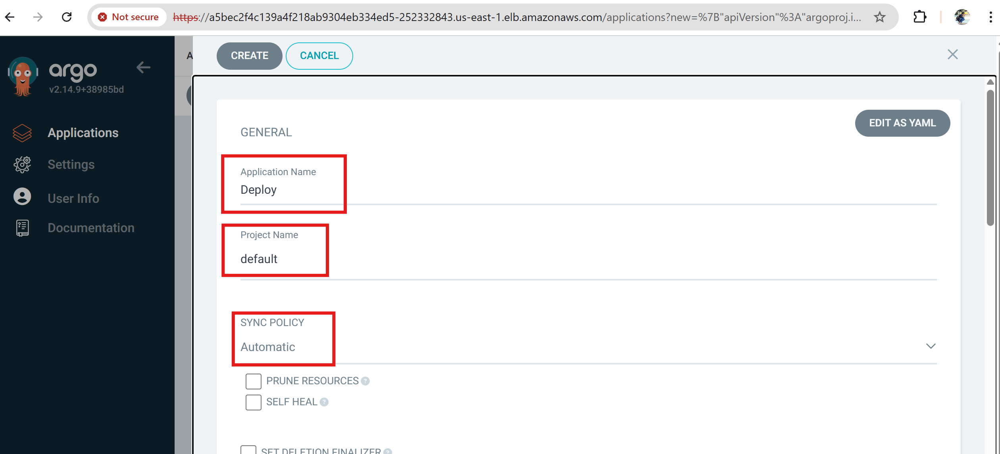
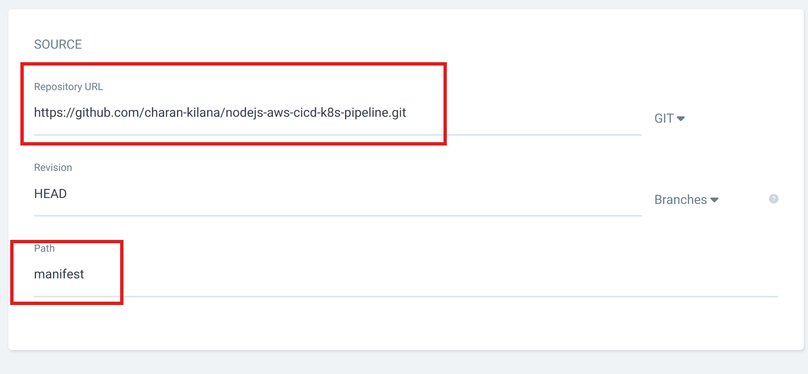
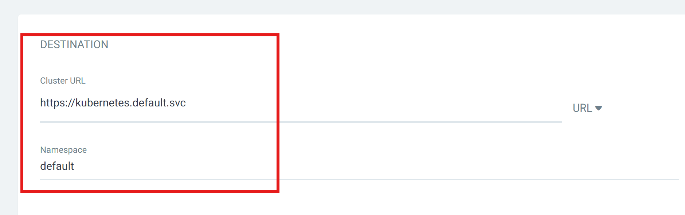

# 🚀 ArgoCD Setup

## ✅ Why ArgoCD?

We use **ArgoCD** as a **GitOps tool** to continuously deploy applications into a Kubernetes cluster by syncing with a Git repository.

---

## 🧰 Install Helm

📖 Official Installation Guide:  
➡️ [https://helm.sh/docs/intro/install/](https://helm.sh/docs/intro/install/)

---

## 🔧 Install ArgoCD using Helm

```bash
helm repo add argo-cd https://argoproj.github.io/argo-helm
helm repo update
kubectl create namespace argocd
helm install argocd argo-cd/argo-cd -n argocd
kubectl get all -n argocd
```

## 🌐 Expose ArgoCD Server (via LoadBalancer)

```bash
kubectl patch svc argocd-server -n argocd -p '{"spec": {"type": "LoadBalancer"}}'
yum install jq -y
export ARGOCD_SERVER=$(kubectl get svc argocd-server -n argocd -o json | jq --raw-output '.status.loadBalancer.ingress[0].hostname')
echo $ARGOCD_SERVER
```


## 🔐 Get ArgoCD Admin Password
```bash
kubectl -n argocd get secret argocd-initial-admin-secret -o jsonpath="{.data.password}" | base64 -d
```
✅ Default username: admin  
🔐 Password: As retrieved from the command above  

## 
Create a app


Give details
| Node.js Dockerfile | Python Dockerfile | GoLang Dockerfile |
|--------------------|-------------------|-----------------|
|  |  |  |


