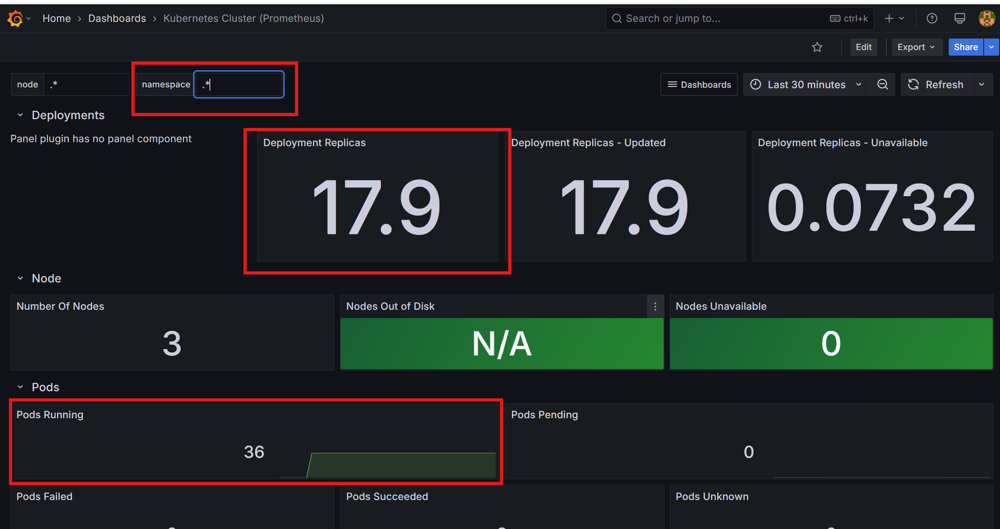

## 📊 Steps to Set Up Prometheus & Grafana on KOPS Cluster

This section explains how to install and configure **Prometheus** and **Grafana** for monitoring a Kubernetes cluster created using **KOPS**.

---

### 🔧 Step 1: Install Helm

[Helm](https://helm.sh/docs/intro/install/) is a package manager for Kubernetes and is required to install Prometheus and Grafana via Helm charts.


## 📈 Install Kubernetes Metrics Server

The **Metrics Server** is required for gathering resource usage data (CPU, memory, etc.) from nodes and pods. It powers commands like:

```bash
kubectl apply -f https://github.com/kubernetes-sigs/metrics-server/releases/latest/download/components.yaml
```

## Verify that the metrics-server deployment is running the desired number of pods 
```bash
kubectl get pods -n kube-system
kubectl get deployment metrics-server -n kube-system
```

## 📡 Install Prometheus in Kubernetes (KOPS Cluster)

### Add Prometheus Helm Repository

To install Prometheus using Helm, first add the official Prometheus community Helm chart repository:

```bash
helm repo add prometheus-community https://prometheus-community.github.io/helm-charts
helm repo update
```
# UPDATE HELM CHART REPOS:  
```bash
helm repo update
helm repo list
```

# CREATE PROMETHEUS NAMESPACE:
```bash
kubectl create namespace prometheus
kubectl get ns
```

# INSTALL PROMETHEUS:
```bash
helm install prometheus prometheus-community/prometheus --namespace prometheus --set alertmanager.persistentVolume.storageClass="gp2" --set server.persistentVolume.storageClass="gp2"
kubectl get pods -n prometheus
kubectl get all -n prometheus
```

 ### CREATE GRAFANA NAMESPACE:
# Add grafana repo
 ```bash
helm repo add grafana https://grafana.github.io/helm-charts
```
 
 # kubectl create namespace grafana
 ```bash
helm install grafana grafana/grafana \
  --namespace grafana \
  --create-namespace \
  --set persistence.enabled=true \
  --set persistence.storageClassName="gp2" \
  --set adminPassword='EKS!sAWSome' \
  --set service.type=LoadBalancer
```
- The password to access the grafana dashboard is ***EKS!sAWSome***  
```bash
kubectl get pods -n grafana
kubectl get service -n grafana
```

# Access the Grafana Dashboard


# Login page of grafana  
Copy the EXTERNAL-IP of service and paste in browser


- Add Datasource from prometheus and paste the link  "http://prometheus-server.prometheus.svc.cluster.local/"  


### 🎉 Hurray! I Implemented the Grafana Dashboard

Below is a preview of the configured dashboard using **Prometheus** as the data source:



## 📊 Monitoring Setup: Ports & Metrics

To enable effective monitoring through Grafana/Prometheus dashboards, ensure the following ports are exposed and accessible:

---

### 🔌 Port `315` — Cluster-Wide Metrics Monitoring

This port is used to monitor overall **cluster performance**. It covers:

- 📡 **Network I/O Pressure**
- 💻 **Cluster CPU Usage**
- 🧠 **Cluster Memory Usage**
- 💾 **Cluster Filesystem Usage**
- 🔄 **Pods CPU Usage**

---

### 🔌 Port `1860` — Per-Node Monitoring

This port provides detailed metrics for **individual node performance**, allowing you to analyze node-level behavior and bottlenecks.

---

📍 Make sure these ports are either:
- Exposed through **LoadBalancer/NodePort**, or
- Included in your **monitoring security group rules (AWS EC2/KOPS)**


